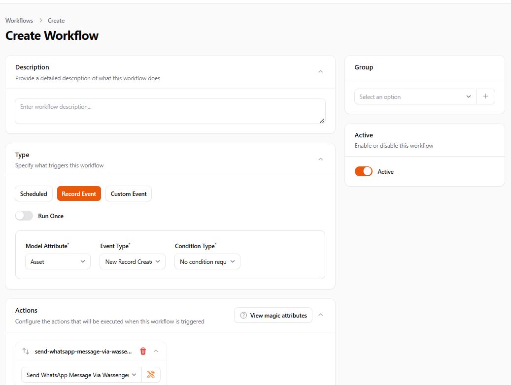
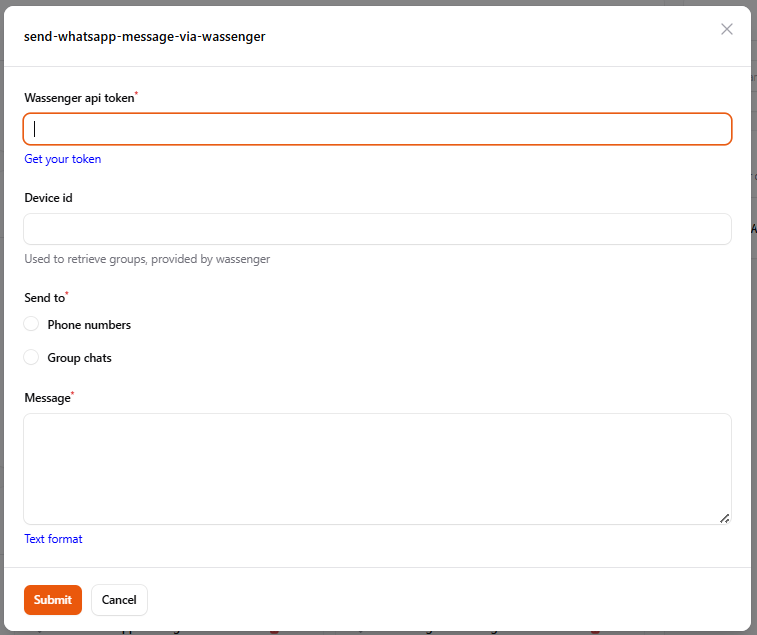
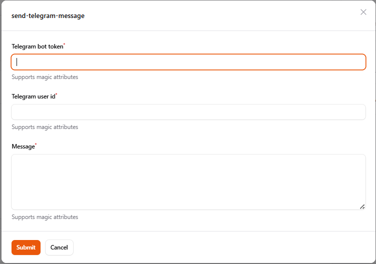

# 🚀 Filament Workflows Plugin for Laravel

## ✨ Introduction

This package is a **FilamentPHP plugin** designed to provide a workflow automation system within FilamentPHP
applications. It enables users to create and manage workflows triggered by model events, custom events, or scheduled
tasks. The package integrates seamlessly with FilamentPHP, offering a Filament Resource for managing workflows.

## 🌟 Features

- 🔄 Workflow automation via **model events, custom events, or scheduling**.
- 🛠️ Filament Resource for **CRUD workflow management**.
- 🏗️ **Supports custom workflow actions**.
- 📜 **Execution logs** viewable through Filament.
- 🔗 Chaining of multiple actions.
- 🌍 **Webhook sending** as an external integration.
- ✨ **Magic Attributes** enable dynamic replacement of placeholders with model attributes or event data, allowing
  seamless data binding and automation within the system.

## Screenshots





## ⚙️ Installation & Setup

### 🖥️ Requirements

Ensure your Laravel application meets the following requirements:

- Laravel 10+
- FilamentPHP 3.2
- PHP 8.1+

### 📥 Install the Package

```bash
composer require monzer/filament-workflows
```

### ⚡ Publish Migration

```bash
php artisan vendor:publish --provider="Monzer\FilamentWorkflows\FilamentWorkflowsServiceProvider" --tag="migrations"
```

### ⚡ Publish Configuration (Optional)

```bash
php artisan vendor:publish --provider="Monzer\FilamentWorkflows\FilamentWorkflowsServiceProvider" --tag="config"
```

### 📊 Migrate Database

```bash
php artisan migrate
```

### 🔧 Registering the Plugin

Users must manually register the plugin in their `PanelProvider.php`:

```php
use Filament\Facades\Filament;
use Monzer\FilamentWorkflows\WorkflowsPlugin;

public function panel(Panel $panel): Panel
{
    return $panel
        ->plugin(WorkflowsPlugin::make());
}
```

## 📌 Setting Up Model Event Workflows

To integrate a model with the model event workflow system, the model must implement the following trait:

```php
use Monzer\FilamentWorkflows\Traits\TrackWorkflowModelEvents;

class Order extends Model
{
    use TrackWorkflowModelEvents;
}
```

## NOTE:

You need to run php artisan schedule:work command to run the workflows.

## 🔧 Configuration

Example configuration in `config/workflows.php`:

```php
return [
    'actions' => [
        \Monzer\FilamentWorkflows\Actions\SendFilamentNotification::class,
        \Monzer\FilamentWorkflows\Actions\SendEmail::class,
        \Monzer\FilamentWorkflows\Actions\SendSmsViaTwilio::class,
        \Monzer\FilamentWorkflows\Actions\CreateRecord::class,
        \Monzer\FilamentWorkflows\Actions\UpdateRecord::class,
        \Monzer\FilamentWorkflows\Actions\SendWebhook::class,
        \Monzer\FilamentWorkflows\Actions\PushFirebaseNotification::class,
        \Monzer\FilamentWorkflows\Actions\BackupMySqlDBUsingMySqlDump::class,
        \Monzer\FilamentWorkflows\Actions\SendWhatsAppMessageViaWassenger::class,
        \Monzer\FilamentWorkflows\Actions\SendTelegramMessage::class
    ],
    //scan the following directories for models
    'models_directory' => [
        'App\\Models',
    ],
    'services' => [
        'firebase' => [
            'server_key' => env('FIREBASE_SERVER_KEY'),
            'model_token_attribute_name' => env('FIREBASE_MODEL_TOKEN_ATTRIBUTE_NAME', 'fcm_token'),
            'icon' => env('FIREBASE_ICON'),
        ],
        'telegram' => [
            'bot_token' => env('TELEGRAM_BOT_TOKEN'),
        ],
        'wassenger' => [
            'api_key' => env('WASSENGER_API_KEY'),
        ],
        'twilio' => [
            'sid' => env('TWILIO_SID'),
            'token' => env('TWILIO_TOKEN'),
            'from' => env('TWILIO_FROM'),
        ],
    ],
];
```

## 🪄 Magic Attributes

Magic attributes are placeholders that get dynamically replaced with actual data from the model or event triggering the
workflow.

### 🔄 **Model Event Workflows**

- **`@email@`** → Replaced by the model's email attribute.
    - Example:
      ```
      Hello @email@, your order has been processed.
      ```
    - If the model contains `email = user@example.com`, the message will be:
      ```
      Hello user@example.com, your order has been processed.
      ```

### 🎭 **Custom Event Workflows**

- **`@event->name@`** → Replaced by the event’s name attribute.
    - Example:
      ```
      A new event named @event->name@ has been created.
      ```
    - If the event contains `name = System Update`, the message will be:
      ```
      A new event named System Update has been created.
      ```

## 🎯 Defining Custom Workflow Actions

Users can create custom actions by implementing the `Action` interface. Below is an example implementation of the *
*SendEmail** action:

```php
namespace Monzer\FilamentWorkflows\Actions;

use Filament\Forms\Components\Textarea;
use Filament\Forms\Components\TextInput;
use Illuminate\Database\Eloquent\Model;
use Illuminate\Support\Facades\Mail;
use Monzer\FilamentWorkflows\Contracts\Action;
use Monzer\FilamentWorkflows\Models\WorkflowActionExecution;

class SendEmail extends Action
{
    public function getId(): string
    {
        return 'send-email';
    }

    public function getName(): string
    {
        return 'Send Email';
    }

    public function getFields(): array
    {
        return [
            TextInput::make('data.email')
                ->helperText("Supports magic attributes")
                ->required(),
            TextInput::make('data.subject')
                ->helperText("Supports magic attributes")
                ->required(),
            Textarea::make('data.message')
                ->helperText("Supports magic attributes")
                ->required()
                ->rows(5),
        ];
    }

    public function getMagicAttributeFields(): array
    {
        return ['email', 'subject', 'message'];
    }

    public function execute(array $data, WorkflowActionExecution $actionExecution, ?Model $model, array $custom_event_data, array &$sharedData)
    {
        Mail::raw($data['message'], function ($message) use ($data) {
            $message->to($data['email'])->subject($data['subject']);
        });
        $actionExecution->log("Email successfully sent to: {$data['email']} regarding: {$data['subject']}");
    }

    public function canBeUsedWithScheduledWorkflows(): bool
    {
        return true;
    }

    public function canBeUsedWithRecordEventWorkflows(): bool
    {
        return true;
    }

    public function canBeUsedWithCustomEventWorkflows(): bool
    {
        return true;
    }
    
    public function requireInstalledPackages(): array
    {
        return [];
    }
}
```

Then add your custom action

```php
use Filament\Facades\Filament;
use Monzer\FilamentWorkflows\WorkflowsPlugin;

public function panel(Panel $panel): Panel
{
    return $panel
        ->plugin(WorkflowsPlugin::make()->actions([CustomAction::class]));
}
```

## 🔗 Sharing Data Between Actions

To allow actions to be aware of each other and share data, a **shared data array** is passed between actions in
the `execute` function. This enables actions to store and retrieve information dynamically as they execute.

### 📌 How It Works:

- Each action **receives a shared data array**.
- Actions can **store values** inside this array to be used by subsequent actions.
- The shared data persists **throughout the workflow execution**.

### 📝 Example: Sharing Data Between Actions

Let's say we need to:

1️⃣ **Generate an Invoice** and store the `invoice_id`.
2️⃣ **Send an Email** using that `invoice_id`.

#### **🛠️ Action 1: Generate Invoice**

```php
class GenerateInvoice extends Action
{
    public function execute(array $data, WorkflowActionExecution $execution, ?Model $model, array $custom_event_data, array &$sharedData)
    {
        // Generate invoice
        $invoiceId = Str::uuid();
        $sharedData['invoice_id'] = $invoiceId;

        $execution->log("Generated Invoice ID: $invoiceId");
    }
}
```

#### **📧 Action 2: Send Email with Invoice ID**

```php
class SendEmail extends Action
{
    public function execute(array $data, WorkflowActionExecution $execution, ?Model $model, array $custom_event_data, array &$sharedData)
    {
        $invoiceId = $sharedData['invoice_id'] ?? 'Unknown';

        Mail::raw("Invoice ID: $invoiceId", function ($message) use ($data) {
            $message->to($data['email'])->subject("Your Invoice");
        });

        $execution->log("Email sent with Invoice ID: $invoiceId");
    }
}
```

## Using workflows with tenancy

Create a middleware to setup tenancy

```php

namespace App\Http\Middleware;

use Monzer\FilamentWorkflows\Models\Workflow;

class ApplyTenantScopes
{
    /**
     * Handle an incoming request.
     *
     * @param \Closure(\Illuminate\Http\Request): (\Symfony\Component\HttpFoundation\Response) $next
     */
    public function handle(Request $request, Closure $next): Response
    {
            Workflow::resolveRelationUsing('team', function ($model) {
            return $model->belongsTo(Team::class, 'team_id');
        });
        return $next($request);
    }
}
```

Then, add the middleware to the panel

```php
use Filament\Facades\Filament;
use Monzer\FilamentWorkflows\WorkflowsPlugin;

public function panel(Panel $panel): Panel
{
    return $panel
            ->tenantMiddleware([
                ApplyTenantScopes::class,
            ], isPersistent: true);
}
```

---

## 🧪 Tests

Currently, **automated tests are not available** for this package. Future updates may include unit tests and integration
tests to ensure workflow stability and execution accuracy.

## ❤️ Support & Contributions

For issues and feature requests, please visit the [GitHub repository](https://github.com/monzer15/filament-workflows) and
create an issue.

Pull requests are welcome. Make sure to follow the contribution guidelines.

## 💰 Support the Project

If you find this package helpful and would like to support its development, consider making a donation:

[☕ Buy Me a Coffee](https://paypal.me/monzer15)

Your support helps improve and maintain this package! 🙌

## 📜 License

This package is licensed under the MIT License. See the `LICENSE` file for details.

